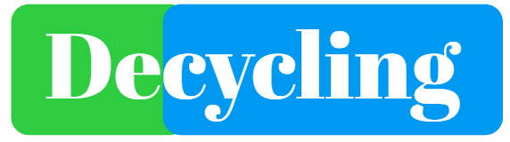

# Overview
Welcome to the DEcycling Framework Repository, an initiative designed to address the intricate balance between ecological sustainability and public health priorities in food packaging. This repository presents methodologies for systematically evaluating recycled materials through a comprehensive scoring system (0-10), helping stakeholders make informed, evidence-based decisions.
The framework, underpinned by rigorous scientific research, aims to transform sustainability practices in food packaging. An associated article is currently under review at [The Lancet](https://www.thelancet.com/). We invite you to stay tuned for further developments.

# Goals:
- Provide a transparent and scientific approach to assessing the sustainability and safety of food packaging.
- Disseminate innovative methodologies, datasets, and case studies to foster global applicability.
- Catalyze advancements in policy and innovation within the sustainable packaging landscape.

# Features:
- Comprehensive Guides: Step-by-step instructions for applying the DEcycling framework, from data collection to scoring.
- Visual Tools: Interactive and accessible tools for quantifying the trade-offs between sustainability and public health risks.
- Empirical Evidence: Detailed, data-driven case studies highlighting real-world applications of the framework.

# Contributing:
We welcome collaborators from academia, industry, and policymaking to contribute to and expand this initiative. Please contact mherrador@ujaen.es for your contributions, these may include:
- New case studies or regional datasets.
- Refinements to the scoring system methodology.
- Tools or extensions that enhance framework accessibility.

# License:
This project is licensed under the [Apache License 2.0](https://github.com/linacquest/DEcycling/blob/main/LICENSE), ensuring that the framework remains open and accessible while preserving proper accreditation for contributors.
